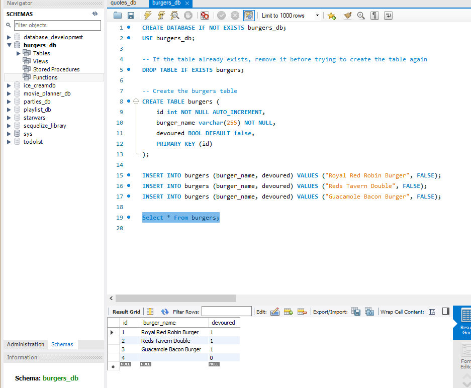
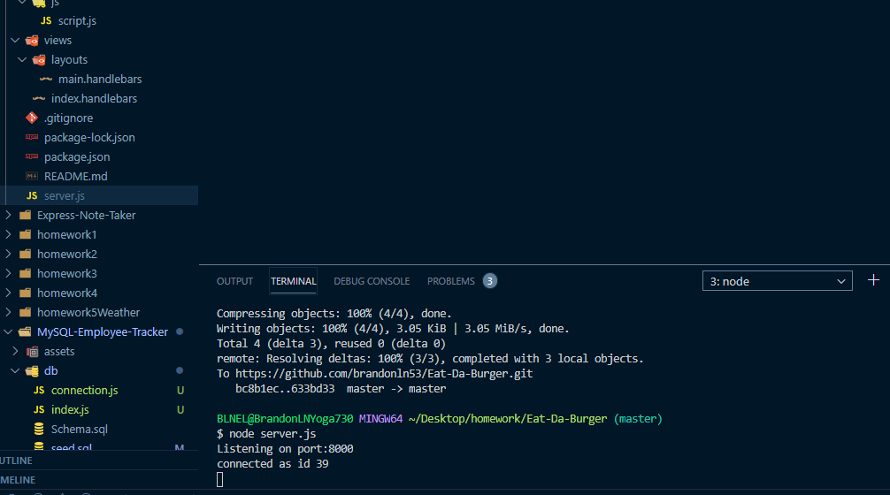
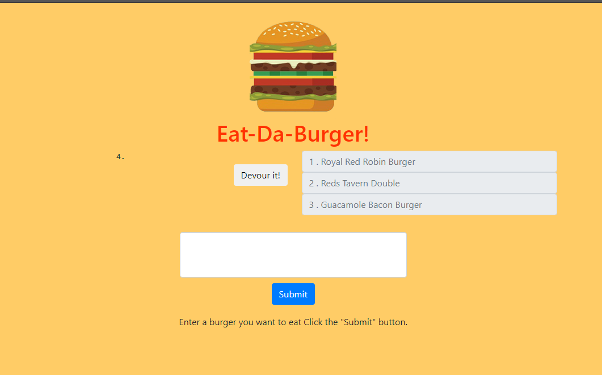

# Node Express Handlebars/Eat-Da-Burger

## Description and Usage
Eat-Da-Burger! is a restaurant app that lets users input the names of burgers they'd like to eat. My son is partial to Red Robin burgers, so this app was built off of that restaurant's prime burgers.

- Whenever a user submits a burger's name, your app will display the burger on the left side of the page waiting to be devoured.

- Each burger in the waiting area also has a Devour it! button. When the user clicks it, the burger will move to the right side of the page.

- Your app will store every burger in a database, whether devoured or not.

## Instructions
1. Make certain you run an npm install; then npm i express, express-handlebars, and mysql.
2. Run the burgers_db in MySQL Workbench and make certain the tables populate.
3. Run node (or nodemon, your preference) server.js and look for the listening to port 8000 prompt.
4. Go to localhost:8000 in your browser (I use Chrome) and run the app.

When you refresh the database in MySQL, you should see the numbers for each burger populate for each devour.

## Screenshots

## Credits
This project is a homework for the University of Denver Full-Stack Web Development Bootcamp. Thank you for view and trying it.

https://github.com/brandonln53/Eat-Da-Burger

